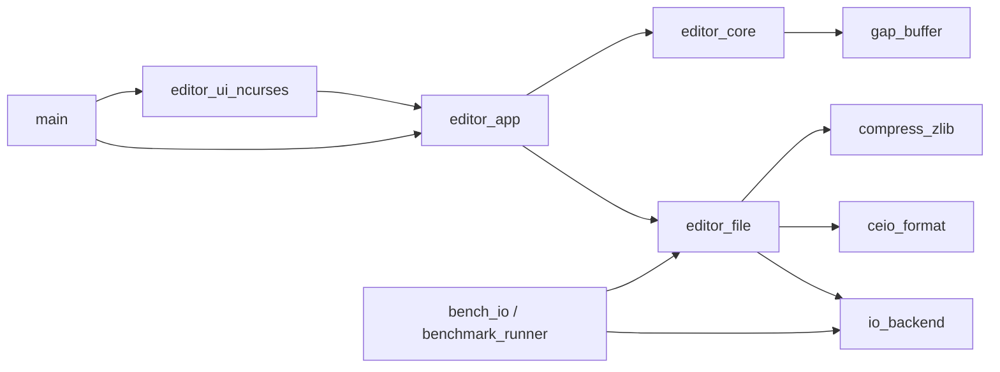
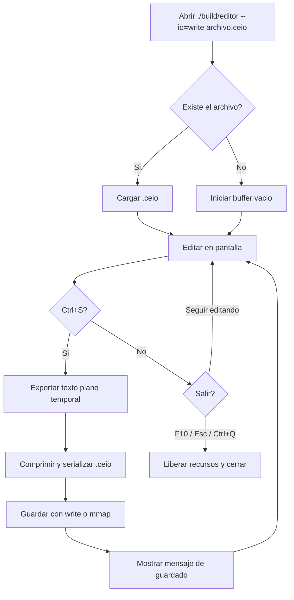
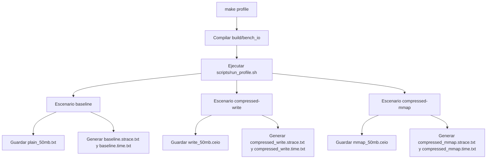

# CEIO Editor

Editor de texto en C/Linux con interfaz tipo nano basada en `ncurses` y
persistencia comprimida en archivos `.ceio`.

La extension `.ceio` significa `CEIO = Compressed Editor I/O`, y representa el
formato binario comprimido definido para este proyecto.

## 1. Objetivo del proyecto

El proyecto busca construir un editor modular que permita editar texto en
memoria y guardarlo comprimido, comparando ademas distintas estrategias de I/O
(`write` y `mmap`) con evidencia real de rendimiento.

## 2. Por que se usa ncurses

`ncurses` resuelve entrada por teclado, posicionamiento del cursor y redibujado
de pantalla en terminal. Eso permite implementar una interfaz sencilla tipo
nano sin mezclar la presentacion con la logica de compresion o de persistencia.

## 3. Por que la UI se separa del core

La UI solo traduce teclas y dibuja el estado actual. El texto vive en
`editor_core`, y el guardado/cargado vive en `editor_file`. 
## 4. Arquitectura modular

- `gap_buffer`: estructura eficiente para insertar y borrar cerca del cursor.
- `editor_core`: nucleo de edicion en memoria y bandera `dirty`.
- `compress_zlib`: compresion y descompresion en user space.
- `ceio_format`: header y payload del formato `.ceio`.
- `io_backend`: escritura real con `write` o `mmap`, lectura desde disco.
- `editor_file`: pipeline de guardado/carga comprimida.
- `editor_app`: coordinador entre UI, core y persistencia.
- `editor_ui_ncurses`: interfaz de terminal y manejo de teclas.
- `benchmark_runner` y `bench_io`: escenarios reproducibles de benchmark.

### Diagrama de modulos



## Entregables academicos incluidos

- Matriz de diseño del pipeline I/O.
- Diagrama de flujo del paso de datos.
- Explicacion de gestion de memoria en C.
- Especificacion del formato binario `.ceio`.
- Reporte de profiling como evidencia de ingenieria.

Todo esto quedo consolidado en `docs/report.md`.

## 5. Responsabilidades por modulo

- `main.c`: parsea argumentos, elige modo de I/O, crea `EditorApp`, carga si el archivo existe, ejecuta la UI y libera recursos.
- `editor_app.c`: conecta `editor_core` con `editor_file`, mantiene estado, filename, modo de I/O y mensajes de estado.
- `editor_ui_ncurses.c`: inicializa `ncurses`, redibuja la pantalla y traduce teclas a llamadas sobre `editor_app`.
- `editor_core.c`: edicion en memoria desacoplada de UI y archivos.
- `editor_file.c`: serializa, comprime, guarda, lee, valida y descomprime archivos `.ceio`.
- `io_backend.c`: implementa los dos backends comparables de escritura final.

## 6. Pipeline de guardado


## 7. Pipeline de carga


## Diagramas de flujo de uso

### Caso 1: crear o editar y guardar



### Caso 2: benchmark y profiling



## 8. Instalar dependencias

```sh
sudo apt-get update
sudo apt-get install build-essential zlib1g-dev libncurses-dev strace valgrind
```

## 9. Compilar

```sh
make clean && make
```

Se generan:

- `build/editor`
- `build/bench_io`
- `build/test_editor_core`
- `build/test_editor_file`

## 10. Ejecutar el editor

Modo `write`:

```sh
./build/editor --io=write documento.ceio
```

Modo `mmap`:

```sh
./build/editor --io=mmap documento.ceio
```

## 11. Guardar y salir

- `Ctrl+S`: guardar
- `Ctrl+Q`: salir
- `F10` o `Esc`: salida alternativa si VS Code o la terminal interceptan `Ctrl+Q`
- Flechas: mover cursor
- `Backspace`: borrar antes del cursor
- `Delete`: borrar en el cursor

Nota: el movimiento vertical se calcula de forma sencilla a partir del buffer
actual y de los saltos de linea. Es suficiente para la sustentacion y mantiene
la UI desacoplada del nucleo de edicion.

## 12. Ejecutar pruebas

```sh
make test
```

## 13. Ejecutar profiling

```sh
make profile
```

Esto compila `build/bench_io`, ejecuta los tres escenarios de benchmark y guarda
resultados en `results/`.

## 14. Revisar resultados

```sh
cat results/baseline.strace.txt
cat results/compressed_write.strace.txt
cat results/compressed_mmap.strace.txt
cat results/baseline.time.txt
cat results/compressed_write.time.txt
cat results/compressed_mmap.time.txt
```

## 15. Validar que el archivo no esta en texto claro

```sh
strings results/write_50mb.ceio | head
hexdump -C results/write_50mb.ceio | head
```

## 16. Como interpretar las metricas

- `calls` en `strace`: cantidad de llamadas al sistema por escenario. Sirve para
  comparar si el baseline hace muchas escrituras pequenas y si `mmap` cambia el
  patron respecto a `write`.
- `user time`: tiempo consumido en user space. Aqui influye la compresion con
  `zlib`.
- `sys time`: tiempo consumido en kernel. Aqui influye la interaccion con el
  sistema operativo.
- `real time`: tiempo total observado desde afuera.
- `final_size_bytes`: tamano real escrito en disco, clave para justificar la
  compresion.

Ademas, para el entregable academico:

- comparar el patron de syscalls entre baseline y pipeline comprimido,
- justificar el costo de CPU de `zlib` con `user time`,
- justificar el costo de kernel con `sys time`,
- verificar que `.ceio` no conserve el texto original en claro.

## Benchmark reproducible

Escenarios:

1. `baseline-plain-small-writes`
2. `compressed-write`
3. `compressed-mmap`

Ejemplos:

```sh
./build/bench_io --mode=baseline --size-mb=50 --output=results/plain_50mb.txt
./build/bench_io --mode=compressed-write --size-mb=50 --output=results/write_50mb.ceio
./build/bench_io --mode=compressed-mmap --size-mb=50 --output=results/mmap_50mb.ceio
```

El benchmark imprime:

- modo ejecutado,
- tamano original,
- tamano final,
- porcentaje de reduccion,
- archivo generado,
- modo de I/O.

El programa no inventa tiempos. Las mediciones reales se obtienen con:

```sh
strace -c -o results/baseline.strace.txt ./build/bench_io --mode=baseline --size-mb=50 --output=results/plain_50mb.txt
/usr/bin/time -v -o results/baseline.time.txt ./build/bench_io --mode=baseline --size-mb=50 --output=results/plain_50mb.txt

strace -c -o results/compressed_write.strace.txt ./build/bench_io --mode=compressed-write --size-mb=50 --output=results/write_50mb.ceio
/usr/bin/time -v -o results/compressed_write.time.txt ./build/bench_io --mode=compressed-write --size-mb=50 --output=results/write_50mb.ceio

strace -c -o results/compressed_mmap.strace.txt ./build/bench_io --mode=compressed-mmap --size-mb=50 --output=results/mmap_50mb.ceio
/usr/bin/time -v -o results/compressed_mmap.time.txt ./build/bench_io --mode=compressed-mmap --size-mb=50 --output=results/mmap_50mb.ceio
```

## Valgrind

```sh
make valgrind
```

`make valgrind` solo ejecuta pruebas no interactivas. No intenta correr
Valgrind sobre la UI de `ncurses`.

## Estructura esperada de resultados

```text
results/
  baseline.strace.txt
  compressed_write.strace.txt
  compressed_mmap.strace.txt
  baseline.time.txt
  compressed_write.time.txt
  compressed_mmap.time.txt
  plain_50mb.txt
  write_50mb.ceio
  mmap_50mb.ceio
```

## Reporte academico

La guia para la sustentacion y la tabla para pegar resultados reales estan en:

- `docs/report.md`
