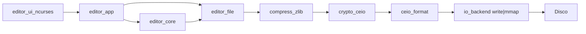

# CEIO Editor

Editor de texto en C/Linux con interfaz `ncurses`, persistencia comprimida y
cifrada en archivos `.ceio`, y evidencia reproducible de benchmarking/profiling.

`.ceio` significa `CEIO = Compressed Editor I/O`. En la version actual el flujo
real de guardado es:

```text
texto plano en RAM -> zlib -> crypto_ceio -> formato .ceio -> write/mmap
```

## Objetivo

- Editar texto en memoria con `GapBuffer`.
- Guardar y cargar archivos `.ceio` comprimidos y cifrados.
- Pedir la clave al usuario dentro del flujo visible, sin argumentos de CLI.
- Comparar tres escenarios de rendimiento:
  A. plano directo,
  B. solo compresion,
  C. compresion + encriptacion.
- Generar evidencia con `strace -c`, `/usr/bin/time -v` y una tabla final para
  la sustentacion.

## Modulos principales

- `editor_core`: logica de edicion en memoria.
- `editor_ui_ncurses`: interfaz de terminal, teclas y entrada oculta de clave.
- `editor_app`: coordina UI, core, persistencia y clave en RAM.
- `compress_zlib`: compresion/descompresion.
- `crypto_ceio`: cifrado simetrico ya integrado por el pipeline.
- `ceio_format`: encabezado `.ceio` version 2, IV y payload cifrado.
- `io_backend`: escritura final con `write` o `mmap`.
- `benchmark_runner` / `bench_io`: escenarios reproducibles.



## Interaccion con clave

- La clave no se recibe por linea de comandos.
- Si el archivo existe, la UI pide la clave al abrirlo.
- Si es un archivo nuevo, la UI pide la clave en el primer `Ctrl+S`.
- La clave se captura con `noecho()` en `ncurses`; no se muestra mientras se
  escribe.
- `EditorApp` guarda una copia temporal con `crypto_secure_alloc_key_copy()` y
  la limpia con `crypto_secure_free_key()` al salir.

## Compilar y probar

Dependencias en Linux/WSL:

```sh
sudo apt-get update
sudo apt-get install build-essential zlib1g-dev libncurses-dev strace valgrind
```

Compilar todo:

```sh
make clean && make
```

Pruebas no interactivas:

```sh
make test
```

## Ejecutar el editor

```sh
./build/editor --io=write documento.ceio
./build/editor --io=mmap documento.ceio
```

Teclas:

- `Ctrl+S`: guardar, pidiendo clave si aun no existe en la sesion.
- `Ctrl+Q`, `F10` o `Esc`: salir.
- Flechas: mover cursor.
- `Backspace` / `Delete`: borrar.

## Benchmark reproducible

Modos disponibles:

```sh
./build/bench_io --mode=baseline --size-mb=50 --output=results/plain_50mb.txt
./build/bench_io --mode=compressed-write --size-mb=50 --output=results/compressed_write_50mb.bin
./build/bench_io --mode=encrypted-write --size-mb=50 --output=results/encrypted_write_50mb.ceio
./build/bench_io --mode=compressed-mmap --size-mb=50 --output=results/compressed_mmap_50mb.bin
./build/bench_io --mode=encrypted-mmap --size-mb=50 --output=results/encrypted_mmap_50mb.ceio
```

Escenarios principales de la tabla:

| Metrica del Kernel | A. Clasico (Plano directo) | B. Solo Compresion | C. Compresion + Encriptacion | Impacto Final (A vs C) |
|---|---:|---:|---:|---|
| Tamano Transmitido (I/O) | `baseline` | `compressed-write` | `encrypted-write` | Cambio porcentual de A a C |
| Tiempo de CPU (User Mode) | `/usr/bin/time -v` | `/usr/bin/time -v` | `/usr/bin/time -v` | Costo extra de comprimir+cifrar |
| Tiempo de Espera I/O | `System time` | `System time` | `System time` | Proxy de latencia kernel/sys |
| Tiempo Total (Wall-clock) | `Elapsed` | `Elapsed` | `Elapsed` | Resultado final |

Generar evidencia completa:

```sh
make profile
```

El script produce:

- `results/*.bench.txt`: salida directa del benchmark.
- `results/*.strace.txt`: resumen de syscalls.
- `results/*.time.txt`: `user`, `sys`, `elapsed`, memoria y pagina.
- `results/benchmark_summary.md`: tabla final A/B/C/Impacto.

Tambien se puede bajar el tamano para pruebas rapidas:

```sh
SIZE_MB=1 RESULTS_DIR=build/profile-test bash scripts/run_profile.sh
```

## Validar que no queda texto claro

```sh
strings results/encrypted_write_50mb.ceio | head
hexdump -C results/encrypted_write_50mb.ceio | head
```

## Reporte academico

La defensa completa, incluyendo orden compresion-cifrado, manejo de llave en
RAM, riesgo de swap, buffer de 4096 bytes, tabla final y preguntas trampa, esta
en:

- `docs/report.md`
