# Reto Final: El Triangulo de Hierro

## Espacio, tiempo y seguridad en CEIO

Este proyecto implementa un editor de texto en C/Linux con interfaz `ncurses` y
persistencia en archivos `.ceio`. El reto final exige que el archivo no solo se
reduzca antes de viajar por el bus de I/O, sino que tambien quede protegido como
dato en reposo.

El problema central es el triangulo entre:

- **Espacio:** reducir bytes escritos a disco con compresion.
- **Tiempo:** medir si el ahorro de I/O compensa el costo extra de CPU.
- **Seguridad:** cifrar el archivo final sin dejar la llave expuesta en RAM.

La arquitectura final usa el siguiente orden:

```text
texto plano -> compresion -> encriptacion -> formato .ceio -> write/mmap
```

Ese orden es obligatorio. Si se cifra antes de comprimir, la entropia sube y el
compresor pierde casi toda su capacidad de encontrar patrones repetidos.

## Objetivo general

Construir un pipeline de memoria en C que aplique dos transformaciones
secuenciales sobre el contenido del editor:

1. Compresion en user space.
2. Encriptacion simetrica en C space.

Luego el sistema debe guardar el resultado con llamadas de sistema controladas,
medir el impacto con `strace` y `/usr/bin/time -v`, y demostrar si el sistema
seguro sigue siendo rentable frente al guardado clasico inseguro.

## Cumplimiento de la rubrica

| Criterio | Implementacion en el proyecto |
|---|---|
| Arquitectura de pipeline | Se comprime primero con `zlib` y despues se cifra con `crypto_ceio`. El archivo `.ceio` guarda el payload ya cifrado. |
| Entropia | El reporte justifica que cifrar antes de comprimir destruye patrones y evita reduccion efectiva de tamano. |
| Memoria y llaves | La clave se pide desde la UI, no va por `argv`, se captura sin eco, se copia a memoria controlada y se borra despues de usarla. |
| Criptografia en C space | El cifrado trabaja sobre buffers en RAM antes de `write()` o `mmap`; no se delega escritura cifrada a librerias externas. |
| Profiling | Hay escenarios separados para plano directo, solo compresion y compresion+encriptacion. |
| Evidencia | `scripts/run_profile.sh` genera `strace`, `time` y una tabla resumen A/B/C. |

## Arquitectura modular

| Modulo | Responsabilidad |
|---|---|
| `editor_core` | Mantiene el texto editable en memoria con `GapBuffer`. |
| `editor_ui_ncurses` | Dibuja la interfaz, traduce teclas y solicita la clave sin mostrarla. |
| `editor_app` | Coordina core, UI, archivo, modo de I/O y llave temporal. |
| `compress_zlib` | Comprime y descomprime buffers en user space. |
| `crypto_ceio` | Encripta y desencripta buffers en RAM con XTEA-CBC y padding PKCS#7. |
| `ceio_format` | Construye y parsea el formato `.ceio` version 2. |
| `io_backend` | Escribe el buffer final con `write` o `mmap`. |
| `benchmark_runner` | Ejecuta escenarios A/B/C y mide tamanos finales. |
| `bench_io` | CLI automatizable para benchmarking. |

## Pipeline de guardado

```mermaid
flowchart LR
    A["Usuario presiona Ctrl+S"] --> B["UI pide clave sin eco"]
    B --> C["editor_app guarda clave temporal"]
    C --> D["editor_core_to_buffer"]
    D --> E["compress_zlib"]
    E --> F["crypto_ceio: XTEA-CBC"]
    F --> G["ceio_format_build"]
    G --> H["io_backend: write o mmap"]
    H --> I["archivo .ceio cifrado"]
    I --> J["clave borrada de RAM"]
```



## Pipeline de carga


## Por que se comprime antes de encriptar

La compresion depende de redundancia. Un texto de 50 MB con lineas repetidas
tiene patrones que `zlib` puede representar con menos bytes. En cambio, un
cifrado correctamente aplicado busca que la salida parezca aleatoria. Esa salida
tiene alta entropia.

Por eso:

```text
Correcto:   texto -> comprimir -> cifrar
Incorrecto: texto -> cifrar -> comprimir
```

Si se usa el orden incorrecto, el archivo puede quedar casi igual de grande o
incluso crecer por metadatos y padding. El sistema seria seguro, pero fracasaria
en optimizar el bus de I/O.

## Criptografia en C space

El modulo `crypto_ceio` implementa una capa simetrica sobre buffers en memoria:

- Cifrado: XTEA.
- Modo: CBC.
- IV: 8 bytes por mensaje.
- Padding: PKCS#7.
- Integridad interna: CRC32 del payload antes de cifrar.

El sistema no usa una API de alto nivel para escribir cifrado al disco. Primero
transforma el buffer en RAM y despues llama al backend de I/O. Esto cumple la
restriccion de que la criptografia sea parte del pipeline de memoria del
programa.

## Formato `.ceio` version 2

El archivo final no guarda texto claro. Guarda un encabezado y un payload
cifrado:

| Campo | Funcion |
|---|---|
| `magic` | Identifica archivos `CEIO`. |
| `version` | Version del formato. |
| `original_size` | Tamano del texto antes de comprimir. |
| `compressed_size` | Tamano despues de `zlib`, antes de cifrar. |
| `encrypted_size` | Tamano del payload cifrado, incluyendo padding. |
| `crc32` | Validacion del contenido original. |
| `crypto_algo` | Identificador del algoritmo usado. |
| `iv_size` / `iv` | IV necesario para CBC; no es secreto. |
| payload | Datos comprimidos y cifrados. |

## Gestion segura de memoria y llaves

La llave no esta quemada en el flujo interactivo del editor y no se recibe por
argumentos de linea de comandos. La solicita la interfaz:

- Al abrir un archivo `.ceio` existente.
- Al guardar con `Ctrl+S`.

Medidas aplicadas:

- `ncurses` usa `noecho()`, asi que la clave no se ve al escribirla.
- La UI borra el buffer temporal con `secure_zero_memory()`.
- `EditorApp` usa `crypto_secure_alloc_key_copy()` para una copia controlada.
- Despues de cargar o guardar, `editor_ui_ncurses` llama
  `editor_app_clear_key()`.
- `crypto_secure_free_key()` limpia la memoria antes de liberarla.
- El modulo intenta usar bloqueo de memoria cuando el sistema lo permite.

Limitacion realista: ningun programa de usuario puede prometer seguridad
perfecta si el sistema permite swap, core dumps o inspeccion de memoria por
procesos privilegiados. La mitigacion consiste en reducir el tiempo de vida de
la clave, borrar copias temporales y no exponerla por `argv`.

## Riesgo de swap

El riesgo de swap aparece cuando el sistema operativo mueve paginas de memoria a
disco. Si una pagina contiene una clave, podria quedar rastro fuera de la RAM.
El proyecto reduce ese riesgo asi:

- Mantiene la clave solo durante la operacion de abrir o guardar.
- Borra el buffer de entrada inmediatamente.
- Limpia la copia dinamica antes de liberarla.
- Intenta bloquear memoria si el entorno lo soporta.

Para un despliegue mas estricto se recomienda deshabilitar core dumps, revisar
limites de `mlock` y controlar politicas de swap del sistema.

## Por que 4096 bytes en el baseline

El escenario clasico escribe texto plano en bloques de 4096 bytes. Este tamano
es razonable porque coincide con el tamano de pagina comun en Linux y evita un
baseline artificialmente malo basado en escrituras demasiado pequenas.

En `/usr/bin/time -v`, el campo `Page size (bytes)` permite confirmar el tamano
de pagina del entorno de prueba.

## Benchmark actualizado

Archivo de prueba sugerido: documento sintetico de 50 MB.

| Metrica del Kernel | A. Clasico (Plano directo) | B. Solo Compresion | C. Compresion + Encriptacion | Impacto Final (A vs C) |
|---|---:|---:|---:|---|
| Tamano Transmitido (I/O) | 50 MB | completar con resultado | completar con resultado | % de reduccion o aumento |
| Tiempo de CPU (User Mode) | completar | completar | completar | overhead de CPU |
| Tiempo de Espera I/O | completar | completar | completar | ahorro de latencia kernel/sys |
| Tiempo Total (Wall-clock) | completar | completar | completar | conclusion de rentabilidad |

El script `scripts/run_profile.sh` genera automaticamente la tabla en:

```text
results/benchmark_summary.md
```

## Escenarios exactos

| Letra | Modo | Descripcion | Salida |
|---|---|---|---|
| A | `baseline` | Texto plano directo en bloques de 4096 bytes. | `plain_50mb.txt` |
| B | `compressed-write` | Solo compresion con `zlib`; sin cifrado. | `compressed_write_50mb.bin` |
| C | `encrypted-write` | Compresion + cifrado + formato `.ceio`. | `encrypted_write_50mb.ceio` |

Escenarios complementarios:

| Modo | Uso |
|---|---|
| `compressed-mmap` | Aisla compresion usando backend `mmap`. |
| `encrypted-mmap` | Mide compresion+cifrado usando backend `mmap`. |

## Aislamiento analitico de cargas

La comparacion separa los costos asi:

- Costo de compresion: `B - A` en user time.
- Costo adicional de encriptacion: `C - B` en user time.
- Ahorro final de I/O: `A - C` en tamano transmitido y system time.
- Rentabilidad final: `A vs C` en wall-clock.

Esto evita asumir que "la seguridad es gratis". La seguridad se mide como costo
extra de CPU y se compara contra el ahorro de bytes escritos.

## Comandos de evidencia

Compilar:

```sh
make clean && make
```

Pruebas:

```sh
make test
```

Profiling completo:

```sh
make profile
```

Ejecucion manual de los tres escenarios principales:

```sh
strace -c -o results/baseline.strace.txt \
  ./build/bench_io --mode=baseline --size-mb=50 --output=results/plain_50mb.txt
/usr/bin/time -v -o results/baseline.time.txt \
  ./build/bench_io --mode=baseline --size-mb=50 --output=results/plain_50mb.txt

strace -c -o results/compressed_write.strace.txt \
  ./build/bench_io --mode=compressed-write --size-mb=50 --output=results/compressed_write_50mb.bin
/usr/bin/time -v -o results/compressed_write.time.txt \
  ./build/bench_io --mode=compressed-write --size-mb=50 --output=results/compressed_write_50mb.bin

strace -c -o results/encrypted_write.strace.txt \
  ./build/bench_io --mode=encrypted-write --size-mb=50 --output=results/encrypted_write_50mb.ceio
/usr/bin/time -v -o results/encrypted_write.time.txt \
  ./build/bench_io --mode=encrypted-write --size-mb=50 --output=results/encrypted_write_50mb.ceio
```

## Interpretacion esperada

Una buena conclusion no debe decir que cifrar no cuesta. Debe decir:

> Anadir seguridad aumenta el tiempo de CPU y puede sumar padding, pero el
> sistema sigue siendo rentable si la reduccion de I/O mantiene el tiempo total
> cerca o por debajo del enfoque clasico inseguro.

Si el resultado final muestra que C ocupa mucho menos espacio y tiene wall-clock
similar o menor que A, el sistema logro el equilibrio: archivo cifrado, menos
bytes en disco y tiempo competitivo.

## Preguntas trampa y respuestas

| Pregunta | Respuesta esperada |
|---|---|
| Por que no cifrar antes de comprimir? | Porque el cifrado aumenta la entropia y destruye los patrones que necesita el compresor. |
| El IV debe ser secreto? | No. Debe ser unico o impredecible, pero puede guardarse en el header. |
| La clave esta hardcoded? | No en el flujo interactivo. Se pide por UI y no viaja por `argv`. |
| El benchmark usa clave fija? | Si, para automatizar mediciones repetibles; no representa el flujo de usuario final. |
| La llave queda en RAM despues de usarla? | La UI borra el buffer temporal y limpia la copia operativa despues de abrir o guardar. |
| Que pasa con swap? | Se reduce el riesgo limpiando memoria y acortando vida de la clave, pero el OS puede requerir politicas adicionales. |
| Como se mide el costo de cifrar? | Comparando `encrypted-write` contra `compressed-write` en `User time`. |
| Como se mide el ahorro de I/O? | Comparando tamano final, `System time` y syscalls de `strace`. |
| `mmap` siempre gana? | No. Depende del patron de acceso, page faults y sincronizacion. Por eso se mide aparte. |

## Conclusion

El proyecto cumple el reto del triangulo de hierro al unir compresion,
encriptacion y profiling reproducible. La decision arquitectonica principal es
comprimir antes de cifrar. Esto conserva el ahorro de espacio y permite que el
costo de seguridad se mida de forma aislada.

La conclusion final debe escribirse con los datos reales de
`results/benchmark_summary.md`: si C reduce fuertemente el tamano y mantiene un
wall-clock cercano o inferior a A, el sistema final es mas seguro y sigue siendo
rentable frente al I/O clasico.
