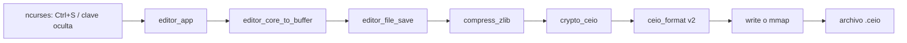
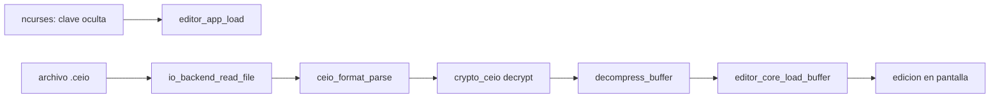

# Reporte final CEIO

## Objetivo de esta entrega

Esta entrega conecta la parte visible del editor con el pipeline comprimido y
cifrado, y deja la evidencia de benchmarking/profiling lista para sustentar el
impacto de la encriptacion frente al costo de I/O.

El proyecto ya tenia editor `ncurses`, persistencia `.ceio`, compresion y
backends `write`/`mmap`. En esta rama se agrego la entrada de clave al flujo de
usuario y se separaron los benchmarks en:

- A. clasico plano directo,
- B. solo compresion,
- C. compresion + encriptacion.

## Cambios en la interaccion con el usuario

La clave no viaja por argumentos de linea de comandos. La pide la interfaz
`ncurses`:

- Al abrir un archivo existente, antes de llamar a `editor_app_load()`.
- Al guardar un archivo nuevo, en el primer `Ctrl+S`.
- Si la clave ya fue ingresada en la sesion, se reutiliza para no pedirla en
  cada guardado.

La captura usa `noecho()`, por lo que la clave no se imprime en pantalla. Luego
`editor_app_set_key()` copia la clave con `crypto_secure_alloc_key_copy()` y
`editor_app_free()` la libera con `crypto_secure_free_key()`, que limpia la
memoria antes del `free`.

## Pipeline final de guardado



## Pipeline final de carga



## Por que se comprime antes de encriptar

La compresion funciona encontrando repeticion y estructura en el texto. Un
cifrado bien aplicado elimina patrones visibles: su salida se parece a datos de
alta entropia. Por eso el orden correcto para este proyecto es:

```text
texto plano -> compresion -> cifrado -> disco
```

Si se invierte el orden:

```text
texto plano -> cifrado -> compresion -> disco
```

`zlib` tendria poco que reducir porque el ciphertext ya no conserva patrones.
El resultado seria mas CPU, tamano casi igual al cifrado original y menor
rentabilidad de I/O. En la sustentacion, esta es una pregunta clave: primero se
comprime para reducir bytes; despues se cifra para proteger esos bytes.

## Manejo de la llave en RAM

La clave queda solamente en memoria de proceso durante la sesion:

- La UI recibe bytes ocultos.
- `EditorApp` crea una copia con `crypto_secure_alloc_key_copy()`.
- El buffer temporal de la UI se borra con `secure_zero_memory()`.
- Al salir, `crypto_secure_free_key()` limpia y libera la copia guardada.
- El codigo intenta bloquear memoria con `mlock` a traves de la API de crypto
  cuando el sistema lo permite.

Limitacion importante: `mlock` puede fallar por permisos o limites del sistema.
Aunque se haga limpieza de memoria, no se puede prometer seguridad perfecta si
el sistema operativo pagina memoria a swap, si hay volcados de core, o si otro
proceso privilegiado inspecciona memoria.

## Riesgo con swap

El riesgo de swap es que una pagina de memoria que contiene la clave sea copiada
al disco por el sistema operativo. Para mitigarlo:

- se mantiene una sola copia de clave en `EditorApp`,
- se borra el buffer temporal inmediatamente,
- se intenta bloquear la memoria de la clave,
- se libera y limpia al cerrar.

Para una defensa academica, la respuesta correcta es: se reduce el riesgo, pero
no se elimina completamente sin politicas del sistema como swap deshabilitado,
limites adecuados de `mlock`, y proteccion contra core dumps.

## Por que 4096 bytes es razonable

El baseline plano usa bloques de `4096` bytes. Ese tamano es razonable porque
coincide con el tamano de pagina comun en Linux y con unidades tipicas de
trabajo del sistema de archivos. Es suficientemente grande para evitar miles de
syscalls diminutas y suficientemente pequeno para no ocultar el comportamiento
del kernel en `strace`.

En `/usr/bin/time -v`, el campo `Page size (bytes)` permite confirmar el tamano
de pagina del entorno de prueba.

## Escenarios exactos del benchmark

| Letra | Modo CLI | Archivo generado | Que mide |
|---|---|---|---|
| A | `baseline` | `plain_50mb.txt` | Texto plano directo, bloques de 4096 bytes |
| B | `compressed-write` | `compressed_write_50mb.bin` | `zlib` sin cifrado, escritura con `write` |
| C | `encrypted-write` | `encrypted_write_50mb.ceio` | `zlib` + `crypto_ceio` + formato `.ceio` |

Evidencia adicional de backend:

| Modo CLI | Archivo generado | Que compara |
|---|---|---|
| `compressed-mmap` | `compressed_mmap_50mb.bin` | Compresion sola con backend `mmap` |
| `encrypted-mmap` | `encrypted_mmap_50mb.ceio` | Compresion+cifrado con backend `mmap` |

## Comandos reproducibles

Compilar:

```sh
make clean && make
```

Pruebas:

```sh
make test
```

Generar evidencia completa:

```sh
make profile
```

Ejecutar el script con salida alternativa y menor tamano:

```sh
SIZE_MB=1 RESULTS_DIR=build/profile-test bash scripts/run_profile.sh
```

Comandos equivalentes para los tres escenarios principales:

```sh
strace -c -o results/baseline.strace.txt \
  ./build/bench_io --mode=baseline --size-mb=50 --output=results/plain_50mb.txt
/usr/bin/time -v -o results/baseline.time.txt \
  ./build/bench_io --mode=baseline --size-mb=50 --output=results/plain_50mb.txt

strace -c -o results/compressed_write.strace.txt \
  ./build/bench_io --mode=compressed-write --size-mb=50 --output=results/compressed_write_50mb.bin
/usr/bin/time -v -o results/compressed_write.time.txt \
  ./build/bench_io --mode=compressed-write --size-mb=50 --output=results/compressed_write_50mb.bin

strace -c -o results/encrypted_write.strace.txt \
  ./build/bench_io --mode=encrypted-write --size-mb=50 --output=results/encrypted_write_50mb.ceio
/usr/bin/time -v -o results/encrypted_write.time.txt \
  ./build/bench_io --mode=encrypted-write --size-mb=50 --output=results/encrypted_write_50mb.ceio
```

## Tabla final de benchmarking

`scripts/run_profile.sh` genera esta tabla automaticamente en
`results/benchmark_summary.md`:

| Metrica del Kernel | A. Clasico (Plano directo) | B. Solo Compresion | C. Compresion + Encriptacion | Impacto Final (A vs C) |
|---|---:|---:|---:|---|
| Tamano Transmitido (I/O) | valor de `baseline` | valor de `compressed-write` | valor de `encrypted-write` | Porcentaje de cambio de A a C |
| Tiempo de CPU (User Mode) | `User time` | `User time` | `User time` | Costo extra por compresion+cifrado |
| Tiempo de Espera I/O | `System time` | `System time` | `System time` | Proxy de latencia kernel/sys |
| Tiempo Total (Wall-clock) | `Elapsed` | `Elapsed` | `Elapsed` | Rentabilidad final |

Formato esperado para pegar resultados reales:

| Metrica del Kernel | A. Clasico (Plano directo) | B. Solo Compresion | C. Compresion + Encriptacion | Impacto Final (A vs C) |
|---|---:|---:|---:|---|
| Tamano Transmitido (I/O) | 50 MB | completar | completar | completar |
| Tiempo de CPU (User Mode) | completar | completar | completar | completar |
| Tiempo de Espera I/O | completar | completar | completar | completar |
| Tiempo Total (Wall-clock) | completar | completar | completar | completar |

## Como cambian los resultados entre A, B y C

Lectura esperada:

- A escribe mas bytes, pero consume poca CPU de transformacion.
- B aumenta CPU por `zlib`, pero reduce mucho el tamano transmitido al kernel.
- C agrega costo de cifrado y padding de bloque sobre B, pero mantiene casi toda
  la reduccion de I/O frente a A.
- Si C reduce el tiempo total frente a A, la conclusion es que el ahorro de I/O
  compensa el costo de CPU.
- Si C no reduce el tiempo total, aun puede justificarse por seguridad, pero ya
  no como optimizacion de rendimiento en ese entorno.

## Conclusiones preliminares

Con datos repetitivos como el texto sintetico del benchmark, la compresion debe
reducir drasticamente el tamano final. La encriptacion agrega CPU y algunos bytes
por IV, header y padding, pero no deberia destruir la ganancia de I/O porque se
aplica despues de comprimir.

La conclusion de rentabilidad debe salir de `results/benchmark_summary.md`: si
`Impacto Final (A vs C)` en wall-clock es negativo, el sistema final es mas
rapido que el plano directo y ademas cifra. Si es positivo, el costo de CPU del
entorno supera el ahorro de I/O y se defiende como mejora de seguridad, no de
velocidad.

## Preguntas trampa y respuestas esperadas

| Pregunta | Respuesta esperada |
|---|---|
| Por que no se cifra antes de comprimir? | Porque el cifrado elimina patrones y hace que `zlib` casi no pueda reducir tamano. |
| La IV debe ser secreta? | No. Debe ser unica/impredecible por mensaje, pero puede ir en el header. |
| La clave queda en disco? | No por este flujo. Se pide en UI, se conserva solo en RAM durante la sesion y se limpia al salir. |
| Se elimina todo riesgo de que la clave toque disco? | No completamente; swap y core dumps dependen del sistema operativo. |
| Por que `System time` se usa como espera I/O? | Es un proxy practico del costo en kernel; se complementa con `strace -c` para ver syscalls. |
| Que demuestra `compressed-write` frente a `encrypted-write`? | Aisla el costo extra del cifrado y padding despues de tener el beneficio de compresion. |
| Por que 4096 bytes? | Coincide con una pagina comun de memoria y evita micro-syscalls artificiales. |
| `mmap` siempre sera mas rapido que `write`? | No. Depende del tamano, patron de acceso, page faults y sincronizacion. Por eso se mide. |
