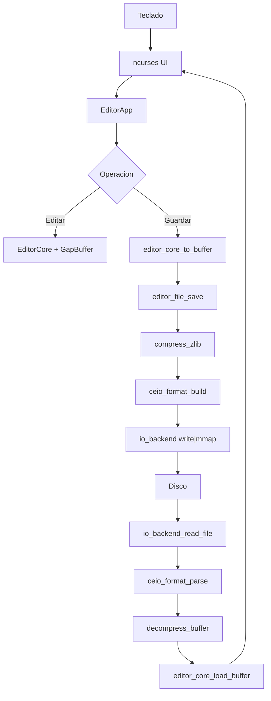

# Reporte Etapa 3

## Introduccion

Esta etapa completa el editor de archivos comprimidos en C/Linux con una
interfaz de terminal basada en `ncurses`, integracion entre edicion en memoria y
persistencia comprimida, y un flujo reproducible de benchmarking y profiling.

En este contexto, `.ceio` significa `CEIO = Compressed Editor I/O`, nombre
elegido para el formato binario comprimido del editor.

## Objetivo del proyecto

Construir un editor de texto modular que permita:

- editar contenido en memoria con `GapBuffer` y `editor_core`,
- guardar y cargar archivos `.ceio` comprimidos con `zlib`,
- comparar academicamente un baseline plano contra el pipeline comprimido,
- comparar los backends de escritura `write` y `mmap`,
- generar evidencia real con `strace -c`, `/usr/bin/time -v` y `valgrind`.

## Justificacion de ncurses

`ncurses` permite implementar una interfaz tipo nano dentro de la terminal sin
mezclar la logica del editor con detalles de dibujo, teclado, refresco de
pantalla o posicionamiento del cursor. Esto reduce complejidad frente a una TUI
manual y deja clara la separacion de responsabilidades.

La navegacion vertical se resuelve con una estrategia sencilla basada en saltos
de linea y posicion del cursor. Esto prioriza claridad del diseno sobre una TUI
mas compleja.

Para facilitar la demostracion en terminales integradas como VS Code, la UI
acepta tambien `F10` y `Esc` como salida alternativa cuando `Ctrl+Q` es
interceptado por el entorno.

## Matriz de modulos

| Modulo | Archivos | Responsable | Funcion | Requisito que cumple |
|--------|----------|-------------|---------|----------------------|
| GapBuffer | `include/gap_buffer.h`, `src/gap_buffer.c` | Integrante 1 | Edicion eficiente alrededor del cursor | Estructura central de texto |
| editor_core | `include/editor_core.h`, `src/editor_core.c` | Integrante 1 | Operaciones logicas de edicion y bandera dirty | Nucleo desacoplado de UI e I/O |
| compress_zlib | `include/compress_zlib.h`, `src/compress_zlib.c` | Integrante 2 | Compresion y descompresion en user space | Persistencia comprimida |
| ceio_format | `include/ceio_format.h`, `src/ceio_format.c` | Integrante 2 | Header y serializacion del formato `.ceio` | Formato propio del proyecto |
| io_backend | `include/io_backend.h`, `src/io_backend.c` | Integrante 2 | Escritura real con `write` o `mmap`, lectura para carga | Comparacion de backends |
| editor_file | `include/editor_file.h`, `src/editor_file.c` | Integrante 2 | Pipeline de guardado/carga comprimido | Integracion persistente |
| editor_app | `include/editor_app.h`, `src/editor_app.c` | Integrante 3 | Coordinacion entre UI, core y persistencia | Desacople arquitectura final |
| editor_ui_ncurses | `include/editor_ui_ncurses.h`, `src/editor_ui_ncurses.c` | Integrante 3 | Interfaz de terminal, teclas y redibujado | Editor interactivo |
| main | `src/main.c` | Integrante 3 | Punto de entrada y parseo de argumentos | Arranque corto y explicable |
| benchmark_runner | `include/benchmark_runner.h`, `src/benchmark_runner.c` | Integrante 3 | Escenarios reproducibles de benchmark | Evidencia de rendimiento |
| bench_io | `src/bench_io.c` | Integrante 3 | CLI del benchmark | Ejecucion automatizable |

## Matriz del pipeline I/O

| Etapa | Entrada | Salida | Modulo |
|------|---------|--------|--------|
| Exportar texto | `EditorCore` | buffer plano temporal | `editor_core_to_buffer` |
| Comprimir | buffer plano | payload comprimido | `compress_zlib` |
| Encapsular | payload comprimido | buffer `.ceio` | `ceio_format` |
| Escribir | buffer `.ceio` | archivo en disco | `io_backend` |
| Leer | archivo en disco | buffer `.ceio` | `io_backend` |
| Decodificar | buffer `.ceio` | payload comprimido | `ceio_format` |
| Descomprimir | payload comprimido | buffer plano | `compress_zlib` |
| Importar texto | buffer plano | `EditorCore` | `editor_core_load_buffer` |

## Matriz de diseño del pipeline I/O

| Paso | Productor | Consumidor | Representacion de datos | Reserva/liberacion de memoria | Observacion |
|------|-----------|------------|--------------------------|-------------------------------|-------------|
| 1 | `editor_core` | `editor_app` | texto plano temporal | `editor_core_to_buffer` reserva, `editor_app_save` libera | Solo existe en RAM |
| 2 | `editor_app` | `editor_file` | `unsigned char *` + `size_t` | Sin copia extra al entrar | Punto de integracion logica/persistencia |
| 3 | `compress_zlib` | `ceio_format` | payload comprimido | `compress_buffer` reserva, `editor_file_save` libera | Compresion en user space |
| 4 | `ceio_format` | `io_backend` | buffer serializado `.ceio` | `ceio_format_build` reserva, `editor_file_save` libera | Incluye header + payload |
| 5 | `io_backend` | disco | bytes persistidos | Sin memoria extra relevante | Se compara `write` vs `mmap` |
| 6 | disco | `io_backend` | archivo `.ceio` completo | `io_backend_read_file` reserva, `editor_file_load` libera | Lectura binaria |
| 7 | `ceio_format` | `compress_zlib` | header parseado + payload | Sin copia del payload | El payload apunta dentro del buffer leido |
| 8 | `compress_zlib` | `editor_core` | buffer plano restaurado | `decompress_buffer` reserva, `editor_app_load` libera | Se valida `crc32` |
| 9 | `editor_core` | UI | estructura interna `GapBuffer` | Vida util controlada por `EditorApp` | El usuario vuelve a editar |

## Diagrama de flujo detallado del paso de datos



## Diagrama textual del flujo de guardado


## Diagrama textual del flujo de carga


## Explicacion de GapBuffer

`GapBuffer` mantiene un hueco cerca del cursor. Insertar es eficiente porque se
escribe dentro de ese hueco; mover el cursor desplaza bytes de un lado al otro
del gap. Esto reduce costo respecto a desplazar el arreglo completo en cada
insercion local.

## Explicacion de compresion en User Space

La compresion se hace con `zlib` en user space antes de escribir a disco. El
kernel no comprime por si mismo el archivo; solamente recibe un buffer ya
serializado. Por eso es valido comparar el costo de CPU de compresion con el
costo de syscalls y de escritura final.

## Explicacion del formato .ceio

El formato `.ceio` incluye:

- magic `CEIO`,
- version del formato,
- tamano original,
- tamano comprimido,
- `crc32` del texto original,
- payload comprimido.

Esto permite validar integridad minima y distinguir claramente el archivo
comprimido del contenido plano del editor.

## Manejo de texto enriquecido si aplica

En esta version no se implementa texto enriquecido con estilos como negrilla,
color o fuentes. Por eso el formato `.ceio` no contiene una tabla de estilos.
La estructura binaria actual es minimalista y suficiente para texto plano
comprimido.

Especificacion binaria actual:

- Bytes `0-3`: magic number `CEIO`.
- Bytes `4-7`: version del formato.
- Bytes `8-11`: tamano original sin comprimir.
- Bytes `12-15`: tamano comprimido.
- Bytes `16-19`: `crc32` del texto original.
- Bytes `20...`: payload comprimido por `zlib`.


## Gestion de memoria en C

El proyecto usa `struct` pequeñas y con campos simples para mantener un layout
facil de razonar:

- `GapBuffer`: puntero + tres `size_t`.
- `EditorCore`: `GapBuffer` + banderas `int`.
- `EditorApp`: `EditorCore` + puntero a filename + modo de I/O + estado.
- `CeioHeader`: campos de 32 bits de tamano fijo.

Decisiones de diseño para reducir desperdicio y padding:

- Se usan tipos enteros de ancho fijo en `CeioHeader` para que el encabezado sea
  estable y facil de serializar.
- Los campos del header tienen el mismo ancho logico, lo que reduce padding
  impredecible respecto a mezclar `char`, `size_t` y `int`.
- En las estructuras de estado se priorizó claridad y costo bajo de acceso; no
  se usan arreglos sobredimensionados salvo `status_message`, que se justifica
  para evitar asignaciones dinamicas frecuentes durante la UI.
- El formato serializado no escribe structs arbitrarios del editor, solo el
  `CeioHeader` y el payload comprimido.

Control de fugas de memoria durante el ciclo de vida:

- `editor_core_to_buffer` reserva un buffer plano y `editor_app_save` lo libera.
- `editor_file_load` reserva un buffer descomprimido y `editor_app_load` lo libera
  despues de pasarlo a `editor_core_load_buffer`.
- `compress_buffer` y `ceio_format_build` reservan buffers temporales y
  `editor_file_save` los libera al terminar.
- `io_backend_read_file` reserva el archivo completo en memoria y
  `editor_file_load` lo libera tras parsear y descomprimir.
- `EditorApp` duplica el nombre de archivo al iniciar y lo libera en
  `editor_app_free`.
- `make valgrind` valida los modulos no interactivos para detectar fugas.

Resumen del ciclo de vida:

```text
init -> reservar estructuras base
load/save -> reservar buffers temporales acotados por modulo
transferir datos -> liberar temporal en el mismo nivel que lo solicito
exit -> editor_app_free -> editor_core_free -> free(filename)
```

## Explicacion de write vs mmap

`write` realiza llamadas explicitas al kernel para enviar bytes al archivo.
`mmap` crea una region mapeada y el programa copia el buffer serializado dentro
de esa region. En este proyecto ambos son comparables porque comparten el mismo
payload `.ceio` y solo cambia el backend final de escritura.

## Explicacion del benchmark

Se miden tres escenarios:

1. `baseline`: escribe texto plano con muchas llamadas pequenas a `write`.
2. `compressed-write`: usa el pipeline real y guarda con backend `write`.
3. `compressed-mmap`: usa el pipeline real y guarda con backend `mmap`.

El baseline existe solo para comparacion academica. El editor final no debe
guardar texto claro.

## Explicacion de profiling con strace/time

- `strace -c` resume llamadas al sistema, cantidades y tiempo relativo en el kernel.
- `/usr/bin/time -v` reporta tiempo real, tiempo de usuario, tiempo de sistema y memoria.

Estas metricas no se inventan dentro del programa: se obtienen desde afuera
para mantener trazabilidad y reproducibilidad.

## Reporte de profiling: evidencia de ingenieria

La evidencia de ingenieria de esta etapa debe incluir:

- comandos exactos ejecutados,
- archivos de salida generados automaticamente,
- resultados sin editar manualmente,
- interpretacion tecnica corta por escenario.

Checklist de evidencia:

1. Salida de `make profile`.
2. `results/baseline.strace.txt`.
3. `results/compressed_write.strace.txt`.
4. `results/compressed_mmap.strace.txt`.
5. `results/baseline.time.txt`.
6. `results/compressed_write.time.txt`.
7. `results/compressed_mmap.time.txt`.
8. Archivos generados `plain_50mb.txt`, `write_50mb.ceio`, `mmap_50mb.ceio`.
9. Captura o copia textual de `strings` y `hexdump` sobre un `.ceio`.

Interpretacion sugerida:

- Baseline: deberia mostrar muchas llamadas `write` y cero compresion.
- Compressed-write: deberia reducir tamano en disco y concentrar escritura en
  menos operaciones grandes.
- Compressed-mmap: deberia evidenciar uso de `mmap`/`munmap` y permitir
  comparar cambios en `sys time` y patron de syscalls frente a `write`.

## Explicacion de validacion con valgrind

`valgrind` se ejecuta sobre pruebas no interactivas. Esto permite detectar fugas
en el core y en la persistencia sin depender de la UI de `ncurses`.

## Tabla para resultados reales

| Metrica | Baseline plano | Compressed write | Compressed mmap | Interpretacion |
|--------|----------------|------------------|-----------------|----------------|
| Tamano original | 52,428,800 bytes | 52,428,800 bytes | 52,428,800 bytes | Los tres escenarios parten del mismo volumen de datos, por lo que la comparacion es valida. |
| Tamano escrito | 52,428,800 bytes | 178,087 bytes | 178,087 bytes | La compresion reduce drasticamente el archivo final respecto al baseline plano. |
| write calls | 819,206 | 7 | 6 | El baseline castiga al kernel con escrituras pequeñas; el pipeline comprimido reduce las llamadas a unas pocas operaciones grandes. |
| mmap calls | 13 | 15 | 16 | Solo el escenario `compressed-mmap` usa `mmap` como backend de guardado; aun asi los tres procesos usan algunos `mmap` del runtime y del loader. |
| user time | 0.74 s | 0.14 s | 0.14 s | El costo de CPU en user space del pipeline comprimido es bajo frente al baseline. |
| sys time | 10.81 s | 0.03 s | 0.03 s | El baseline concentra el costo en el kernel por la enorme cantidad de syscalls `write`. |
| real time | 2:11.47 | 0:00.16 | 0:00.17 | El pipeline comprimido es varias ordenes de magnitud mas rapido en tiempo total observado. |

Metricas complementarias observadas:

- Reduccion aproximada de tamano en `compressed-write` y `compressed-mmap`: `99.66%`.
- `compressed-mmap` mostro `1` llamada a `msync` y `1` llamada a `ftruncate`, coherentes con su backend.
- Memoria residente maxima:
  `baseline` 52,736 KB,
  `compressed-write` 53,120 KB,
  `compressed-mmap` 53,248 KB.
- Cambios de contexto voluntarios:
  `baseline` 819,227,
  `compressed-write` 29,
  `compressed-mmap` 76.


## Conclusiones


Con base en los resultados reales de `results/`, se pueden defender las
siguientes conclusiones academicas:

1. El baseline plano es intencionalmente ineficiente y cumple bien su papel de
comparacion. Sus `819,206` llamadas a `write` elevan el `sys time` a `10.81 s`
y el tiempo real a `2:11.47`, mostrando el costo de escribir en fragmentos
pequenos.

2. El pipeline comprimido no solo reduce almacenamiento, sino tambien costo de
I/O. Tanto `compressed-write` como `compressed-mmap` transforman `50 MB` de
texto en solo `178,087 bytes`, una reduccion cercana al `99.66%`.

3. La disminucion drastica de syscalls explica buena parte de la mejora de
rendimiento. Pasar de cientos de miles de `write` a solo `6-7` escrituras
reduce fuertemente la intervencion del kernel y los cambios de contexto.

4. En este experimento, `write` y `mmap` tienen desempenos globales muy
cercanos. Ambos escenarios comprimidos muestran `0.14 s` de `user time` y
`0.03 s` de `sys time`, con tiempos reales de `0.16 s` y `0.17 s`
respectivamente. Esto sugiere que, para este volumen y este patron de acceso,
la diferencia dominante no es el backend final sino la compresion y la enorme
reduccion del volumen escrito.

5. El backend `mmap` deja una huella de syscalls consistente con su diseño:
aparecen `mmap`, `munmap`, `msync` y `ftruncate`. El backend `write`, en cambio,
mantiene una traza mas simple centrada en pocas llamadas `write`. Esto permite
justificar experimentalmente la comparacion pedida por la rubrica.

6. El consumo de memoria residente maxima se mantiene del mismo orden en los
tres escenarios, alrededor de `52-53 MB`. Por lo tanto, el hallazgo principal
de la etapa no es una mejora fuerte de memoria, sino una mejora clara en
persistencia, tamano final y costo de interaccion con el sistema operativo.
